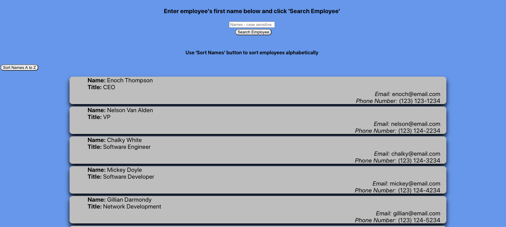

<h1>Employee Directory</h1>
<h2>John Manouse</h2>

I created an Employee Directory using React that will allow a user to view, all employees when the page loads. The user can sort the employees alphabetically, or search for an employee by name.

 
<h2>Employee Directory</h2>
<ul>
    <li>HTML code</li>
    <li>CSS</li>
    <li>Javascript</li>
    <li>node.js</li>
    <li>React</li>
</ul>

<h2>Pull Requests welcome for contribution</h2>

John Manouse

Github: <a href="https://github.com/Mirageg4/employee-directory-react">employee-directory-react</a>

Live Link: <a href="https://mirageg4.github.io/employee-directory-react">Live Link</a>

In the project directory, you can run:

### `yarn start`

Runs the app in the development mode. 
Open [http://localhost:3000](http://localhost:3000) to view it in the browser.

## Learn More

You can learn more in the [Create React App documentation](https://facebook.github.io/create-react-app/docs/getting-started).

To learn React, check out the [React documentation](https://reactjs.org/).

              

License: Project is licensed under the MIT License. 
See <a href ="LICENSE.md">LICENSE</a> file for details.
